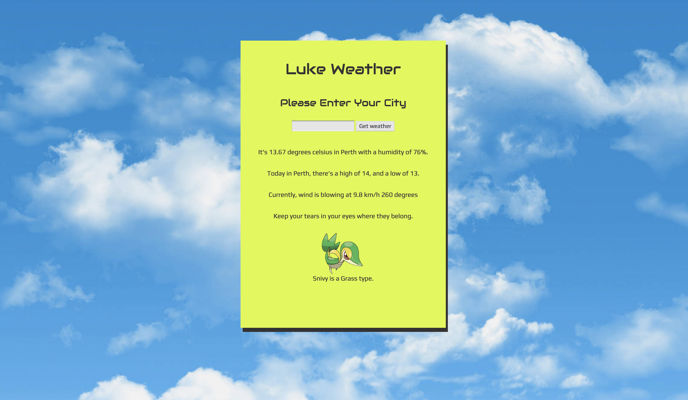

Weather-api hits 3 APIs at the same time with Async Await.

When a user submits a city name, details about the weather are returned as well as a quote from Ron Swanson and a randomly generated Pokemon.

This was just to play with multiple, simultaneous API requests in Express JS & Node.

